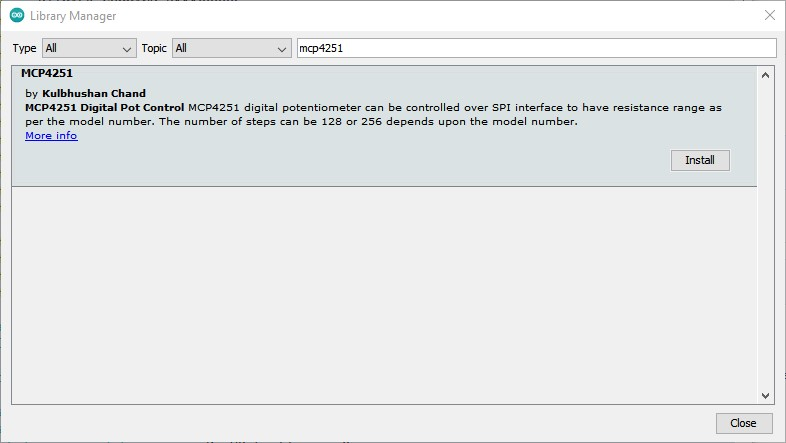
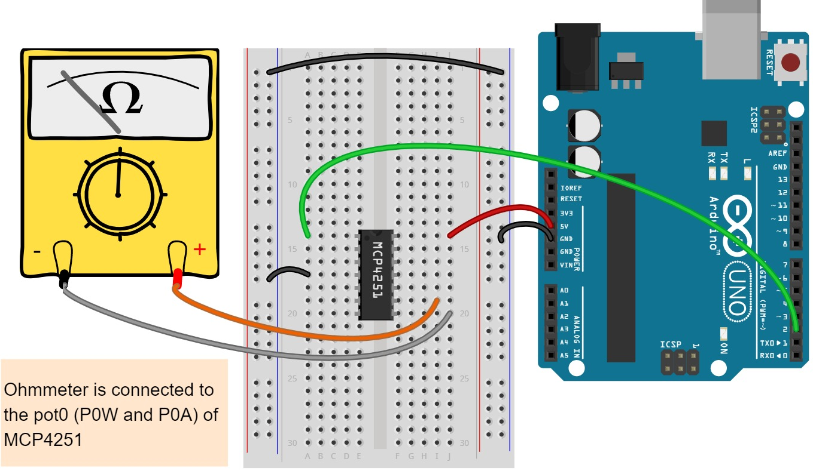

## Table of Contents

- [About](#about)
- [Features](#features)
- [Installation](#installation)
  - [First method](#first-method)
  - [Second method](#second-method)
- [Functions](#functions)
- [Usage](#usage)
- [Documentation](#documentation)
- [Contributing](#contributing)
- [License](#license)
- [Contact](#contact)
- [Acknowledgment](#acknowledgment)
- [Citation](#citation)


## About

This library can be used for interfacing and controlling the MCP4251 IC with the Arduino. The MCP4251 IC is a volatile, 8-bit (257 wiper steps) digital potentiometers with an SPI compatible interface. It is available with end-to-end resistor values of 5KΩ, 10KΩ, 50kΩ and 100KΩ. More information on the [product page](https://www.microchip.com/wwwproducts/en/MCP4251).Other MCP42xx family ICs can also be used, but full functionality of the library may not be guaranteed.


## Features

- All available controls as per [MCP4251 datasheet](https://ww1.microchip.com/downloads/en/DeviceDoc/22060b.pdf).
- Additional functions like `DigitalPotResistanceToPosition` and `DigitalPotPositionToResistance`.
- Simple to use.
- Multiple MCP4251 ICs can be interfaced and controlled, subjected to the availability of I/O pins on Arduino board.


## Installation

### First method



1. In the Arduino IDE, navigate to Sketch > Include Library > Manage Libraries
2. Then the Library Manager will open and you will find a list of libraries that are already installed or ready for installation.
3. Then search for MCP4251 using the search bar.
4. Click on the text area and then select the specific version and install it.

### Second method

1. Navigate to the [Releases page](https://github.com/kulbhushanchand/MCP4251/releases).
2. Download the latest release.
3. Extract the zip file
4. In the Arduino IDE, navigate to Sketch > Include Library > Add .ZIP Library


## Functions

- Set wiper position

```
- DigitalPotWiperIncrement
- DigitalPotWiperDecrement
- DigitalPotSetWiperPosition
- DigitalPotSetWiperMin
- DigitalPotSetWiperMax
- DigitalPotSetWiperMid
- DigitalPotReadWiperPosition
```

- Set control registers

```
- DigitalPotReadTconRegister
- DigitalPotReadStatusRegister
- DigitalPotWriteTconRegister
```

- Enable/disable connections

```
- DigitalPotStartup
- DigitalPotShutdown
- DigitalPotTerminalBConnect
- DigitalPotTerminalBDisconnect
- DigitalPotTerminalAConnect
- DigitalPotTerminalADisconnect
- DigitalPotWiperConnect
- DigitalPotWiperDisconnect
- DigitalPotInitTcon
```

- Additional

```
- DigitalPotResistanceToPosition
- DigitalPotPositionToResistance
```

## Usage

Two examples are available in library. Following is the simple example of interfacing a single MCP4251 with the Arduino. Only one potentiometer (pot0) is controlled and wiper is set to a position = `256`.



```cpp
#include <MCP4251.h>

#define chipSelectPin 53
#define pot0ResistanceRmax 98600 // These resistance values may vary
#define pot0ResistanceRmin 113.5
#define pot1ResistanceRmax 98600
#define pot2ResistanceRmin 130

MCP4251 digitalPot(chipSelectPin, pot0ResistanceRmax, pot0ResistanceRmin, pot1ResistanceRmax, pot2ResistanceRmin);

bool potNum = 1;
uint16_t pos;

void setup()
{
    Serial.begin(9600);
    digitalPot.begin();
}

void loop()
{
    pos = 256;
    digitalPot.DigitalPotSetWiperPosition(potNum, pos);

    while(1)
    {
    }
}
```


## Documentation

The documentation is available at https://kulbhushanchand.github.io/MCP4251/


## Contributing

Any contributions you make are greatly appreciated. You can contribute to this project in the following ways :

- Add new functionality
- Review code
- Raise issues about bugs/features/doubts
- Proof-read the documentation
- Cite if used in a publication
- Star on GitHub
- Share with others

Please note that this project is released with a [Contributor Code of Conduct](https://github.com/kulbhushanchand/MCP4251/blob/master/CODE_OF_CONDUCT.md). By contributing to this project you agree to abide by its terms.


## License

This project is distributed under the `GPLv3` License. See [LICENSE](https://github.com/kulbhushanchand/MCP4251/blob/master/LICENSE) for more information.


## Acknowledgment

The open-source tools used in development of this project.

- [drawio-desktop](https://github.com/jgraph/drawio-desktop) is used to create logo and diagrams.
- [Fritzing](https://fritzing.org/) is used to create the connection diagram.


## Contact

[Kulbhushan Chand](https://kulbhushanchand.github.io/about/)